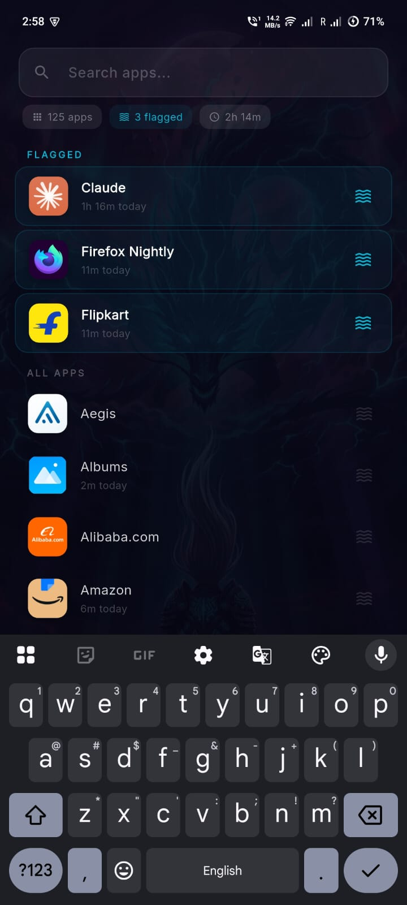
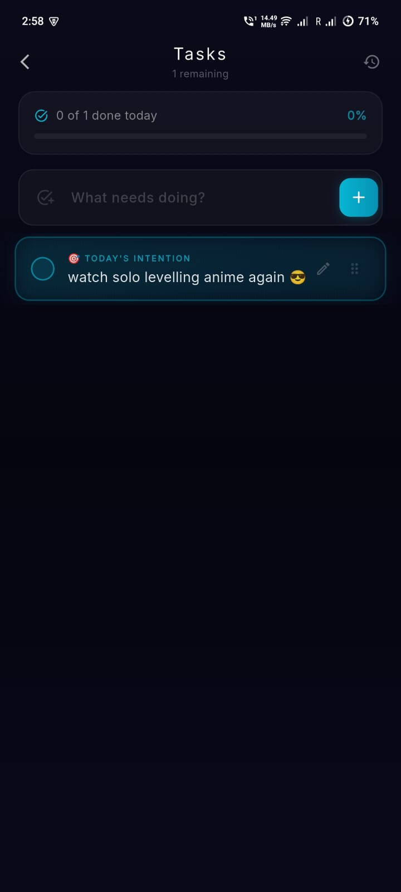
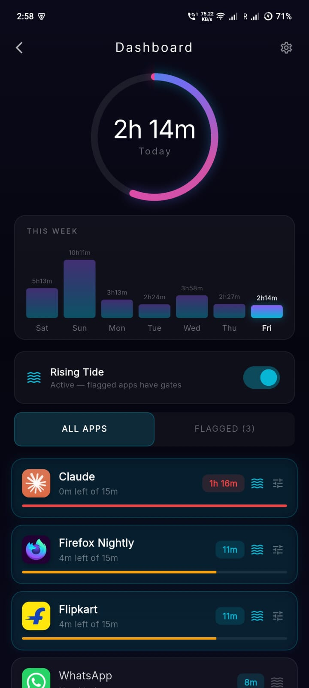
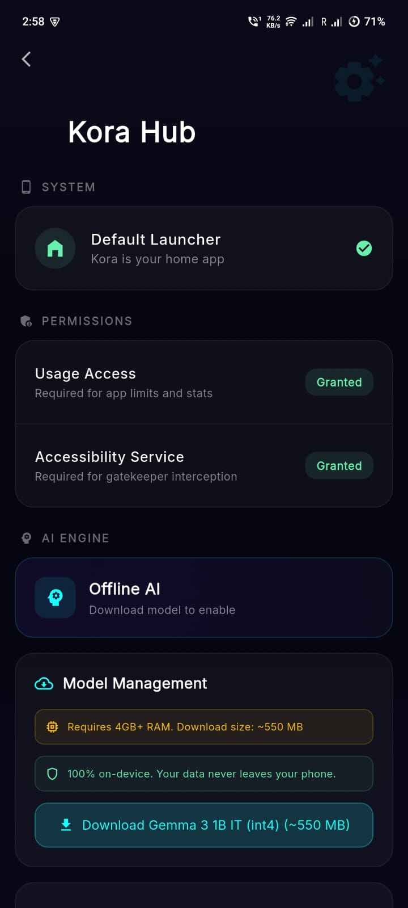

# Kora Launcher

> A launcher that asks why. Behavioral screen-time control for Android.

Kora is an open-source, beautifully designed, behavioral Android launcher. It is built to help users manage their screen time by introducing friction—such as the "Rising Tide" AI gatekeeper—before they can open distracting applications.

## Features

> ⚠️ **Note:** The "Rising Tide" interception system and Offline AI integration are currently in **active development** and may undergo significant changes.

- **Glassmorphic UI**: Premium, dark-themed, glassmorphic design that doesn't obscure your wallpaper.
- **Rising Tide Interception**: Set application limits. When opening flagged applications, Kora intercepts you with offline AI to ask *why* you are opening the app.
- **Offline AI Engine**: Powered by an on-device language model (runs 100% locally with no internet connection required) to provide context-aware prompts.
- **Smart App Drawer**: Floating search bar, categorized flagged apps, and usage statistics.
- **To-Do Hub**: Integrated task manager with daily intentions, progress tracking, and history.
- **Kora Hub**: Centralized dashboard to manage AI models, device permissions, and launcher settings.

## Screenshots

<div align="center">
  
  
  
  
  
</div>

## Getting Started

### Prerequisites
- Flutter SDK 3.11.3 or higher
- Dart SDK 3.6.1 or higher
- Android Studio / Android SDK

### Installation

1. Clone the repository:
   ```bash
   git clone https://github.com/iampownkumar/koralauncher.git
   cd koralauncher
   ```

2. Get dependencies:
   ```bash
   flutter pub get
   ```

3. Run the app:
   ```bash
   flutter run --dart-define-from-file=.env
   ```
   *(Note: You need to create a `.env` file at the root for `SENTRY_DSN` if you want to test crash reporting).*

## Building for Release

To build an APK for release:
```bash
flutter build apk --release --dart-define-from-file=.env
```
The compiled APK will be located at `build/app/outputs/flutter-apk/app-release.apk`.

## License

This project is licensed under the MIT License - see the [LICENSE](LICENSE) file for details.
